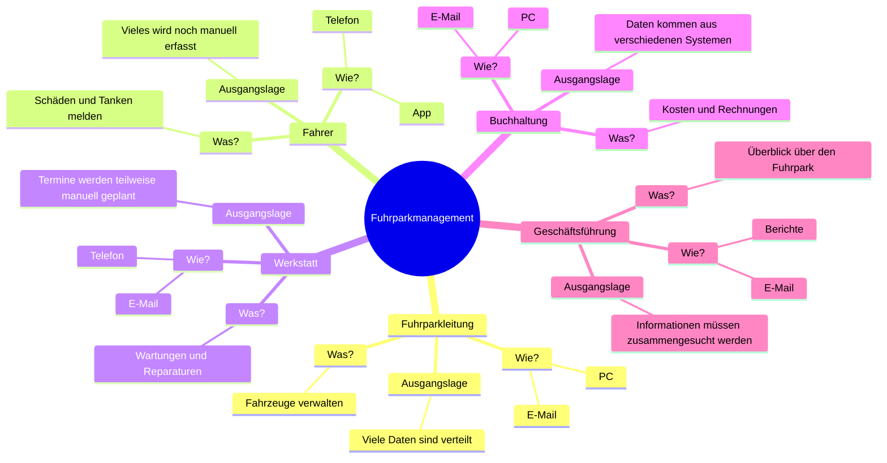
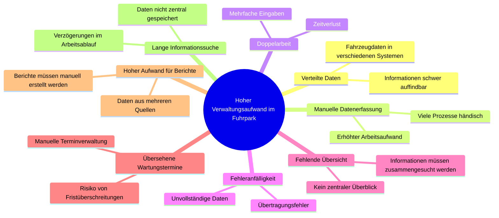

# Verwaltungsaufwand im Fuhrpark

```text
                    ┌─────────────────────┐
                    │  Hoher Zeitaufwand  │
                    │  bei Verwaltung     │
                    └──────────┬──────────┘
                               │
     ┌─────────────────────────┼─────────────────────────┐
     │                         │                         │
     ▼                         ▼                         ▼

┌──────────────┐      ┌─────────────────┐      ┌─────────────────┐
│ Daten in     │      │ Manuelle        │      │ Termine werden  │
│ mehreren     │      │ Datenerfassung  │      │ übersehen       │
│ Systemen     │      │                 │      │                 │
└──────┬───────┘      └────────┬────────┘      └────────┬────────┘
       │                       │                        │
       ▼                       ▼                        ▼
 Informationen        Fehleranfälligkeit      Wartungen werden
 müssen gesucht       und Doppelarbeit        zu spät geplant

                              │
                              ▼

                  ┌─────────────────────────┐
                  │ Ausgangsproblem         │
                  │ Verwaltungsaufwand im   │
                  │ Fuhrpark ist zu hoch    │
                  └─────────────────────────┘

                              ▲
                              │

     ┌────────────────────────┼────────────────────────┐
     │                        │                        │
     ▼                        ▼                        ▼

┌──────────────┐     ┌─────────────────┐     ┌─────────────────┐
│ Fehlende     │     │ Schlechte       │     │ Hoher Aufwand   │
│ Übersicht    │     │ Kommunikation   │     │ bei Berichten   │
│ über Fuhrpark│     │ zwischen Rollen │     │ und Auswertungen│
└──────────────┘     └─────────────────┘     └─────────────────┘

```





# Projektvision
Unsere Projektvision ist es, ein digitales Fuhrparkmanagement-System zu entwickeln, das alle relevanten Informationen und Prozesse rund um Fahrzeuge, Fahrer, Wartungen und Kosten zentral in einer Plattform zusammenführt.
Wir möchten die derzeit verteilten Datenquellen und manuellen Arbeitsabläufe durch eine moderne, benutzerfreundliche Lösung ersetzen, die Transparenz schafft, Verwaltungsaufwände reduziert und Fehler minimiert.
Die Plattform soll allen Beteiligten, von Fahrern über die Fuhrparkleitung bis hin zur Buchhaltung und Geschäftsführung, den Zugriff auf aktuelle und relevante Informationen ermöglichen. Durch automatisierte Erinnerungen, digitale Meldungen und aussagekräftige Auswertungen werden Prozesse vereinfacht und Entscheidungen erleichtert.
Langfristig schaffen wir eine zentrale Informationsbasis, die den gesamten Fuhrpark effizienter, transparenter und zukunftssicher verwaltet.